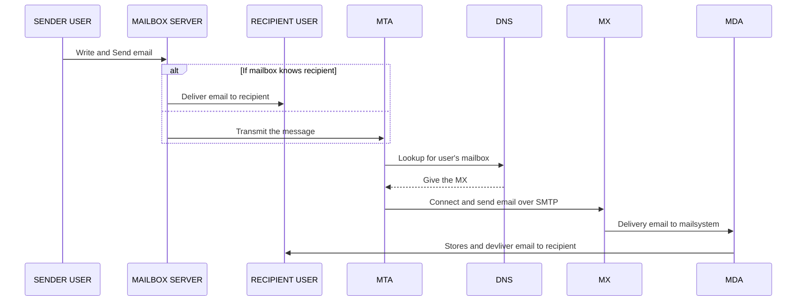

# IP - Internet Protocol

**Responsabilities** - Switching packets into datagrams, addressing devices and routing packages across internet.

**Addressing** - Manually or Dinamic using Dinamic Host Configuration Protocol (DHCP).

**Human Readable** - Numeric address are not readable by humans, so Domain Name System (DNS) are used to give a name for the IP Address.

**Name Resolution** - The DNS is resolved by a sequence of queries, starting at top level domain label (root server) and recursively querying after each server anwser. There are 13 root servers. This recursive query follows the Fully Qualified Domain Name (FQDN).

**FQDN** - It is a Domain Name that specifies its exact location in tree hierarchy of DNS. 

**Routing** - Forward the packets from the sender to recipient device across the internet using routers devices. The router devices are responsible to foward a package to a hop closer node to the destination.

# TCP - Transmission Control Protocol

**Responsabilities** - creation, reliability of delivery and assembling of packets of data. 

**Reliability** - connections between communication hosts. A host is an application represented by a port number. Packets are created, sequenced, transmitted, acknowledged and retrasmitted (if necessary).

**Avoid packet congestion** - use slide window

# FTP

File Transfer Protocol (FTP) is used when we need to transfer files between clients and servers. The standard FTP does not provide any security layer and the data travels without any cryptography. Because this, emerged some ways to use FTP in a secure way.

**SFTP** - SSH File Transfer Protocol is the FTP Protocol over a SSH layer. The SFTP uses a single channel for commands and data transfering. It is possible to use basic authentication with encrypted user and password. It can also use SSH key for authentication, that works with public and private keys. Se more about public and private keys in [SSH Session](https://github.com/matheus-almeida-rosa/micromaster-cloudcomputing/blob/master/engineering-management/week1.md#ssh). 

**FTPS** - FTP over SSL (Secure Socket Layer). It uses User ID, password and CA Signed Certificate. 

# SSH

# Cloud Migration

## Mail Server Cloud Migration

There are three main categories of mail services:

- Mail Transfer Agent (MTA): Software that transmits messages from sender to recipients that are connected locally or through the internet. 
- Mail Delivery Agent (MDA): Software that delivery and stores the messages received from MTA to a local mailbox.
- Other Mail Services: Authentication and Anti-Span. Authentication can provide a Single Sign On to access organization systems. Anti-Span helps to filter undesirable mails like marketing messages.

A mail server facilitate the sending and receiving of mail messages. The message flow is described below.
 

---
##### To visualize diagram install the extension [GitHub + Mermaid](https://chrome.google.com/webstore/detail/github-%20-mermaid/goiiopgdnkogdbjmncgedmgpoajilohe?hl=en)
---

Some useful commands are: nslookup or dig/host for lookup the IP address of mail servers providers.

## Website Cloud Migration

A website can provide several informations in page formats to an user using a web browser. The user supply a Uniform Resource Locator (URL) to the browser. A server that serve the pages of a website is called Webserver and it uses the Hypertext Transfer Protocol to serve these pages.

```mermaid
 sequenceDiagram
    participant CLIENT
    participant LOCAL DNS
    participant DNS SERVER
    participant ROOT SERVER
    participant TOP LEVEL SERVER
    participant RIGHT DNS SERVER
    participant WEBSERVER

    CLIENT->>LOCAL DNS: Browse with typed URL
    
    alt If local DNS has the entry
     LOCAL DNS->>CLIENT: Deliver the IP
    else
     LOCAL DNS->>DNS SERVER: Request resolution for DNS
    end
    
    alt If DNS SERVER has the entry
     DNS SERVER-->>CLIENT: Deliver the IP
    else
     DNS SERVER->>ROOT SERVER: Request resolution for DNS
     ROOT SERVER->>TOP LEVEL SERVER: Request resolution for DNS
     TOP LEVEL SERVER->>RIGHT DNS SERVER: Request resolution for DNS
     RIGHT DNS SERVER-->>CLIENT: Deliver the IP
    end
    
    CLIENT->>WEBSERVER: Requests data using IP
    WEBSERVER-->>Returns data
```
---
##### To visualize diagram install the extension [GitHub + Mermaid](https://chrome.google.com/webstore/detail/github-%20-mermaid/goiiopgdnkogdbjmncgedmgpoajilohe?hl=en)
---
