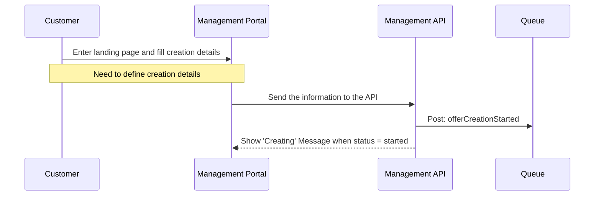

# IP - Internet Protocol

**Responsabilities** - Switching packets into datagrams, addressing devices and routing packages across internet.

**Addressing** - Manually or Dinamic using Dinamic Host Configuration Protocol (DHCP).

**Human Readable** - Numeric address are not readable by humans, so Domain Name System (DNS) are used to give a name for the IP Address.

**Name Resolution** - The DNS is resolved by a sequence of queries, starting at top level domain label (root server) and recursively querying after each server anwser. There are 13 root servers. This recursive query follows the Fully Qualified Domain Name (FQDN).

**FQDN** - It is a Domain Name that specifies its exact location in tree hierarchy of DNS. 

**Routing** - Forward the packets from the sender to recipient device across the internet using routers devices. The router devices are responsible to foward a package to a hop closer node to the destination.

# TCP - Transmission Control Protocol

**Responsabilities** - creation, reliability of delivery and assembling of packets of data. 

**Reliability** - connections between communication hosts. A host is an application represented by a port number. Packets are created, sequenced, transmitted, acknowledged and retrasmitted (if necessary).

**Avoid packet congestion** - use slide window

# FTP

File Transfer Protocol (FTP) is used when we need to transfer files between clients and servers. The standard FTP does not provide any security layer and the data travels without any cryptography. Because this, emerged some ways to use FTP in a secure way.

**SFTP** - SSH File Transfer Protocol is the FTP Protocol over a SSH layer. The SFTP uses a single channel for commands and data transfering. It is possible to use basic authentication with encrypted user and password. It can also use SSH key for authentication, that works with public and private keys. Se more about public and private keys in [SSH Session](https://github.com/matheus-almeida-rosa/micromaster-cloudcomputing/blob/master/engineering-management/week1.md#ssh). 

**FTPS** - FTP over SSL (Secure Socket Layer). It uses User ID, password and CA Signed Certificate. 

# SSH

# Cloud Migration

## Mail Server Cloud Migration

There are three main categories of mail services:

- Mail Transfer Agent (MTA): Software that transmits messages from sender to recipients that are connected locally or through the internet. 
- Mail Delivery Agent (MDA): Software that delivery and stores the messages received from MTA to a local mailbox.
- Other Mail Services: Authentication and Anti-Span. Authentication can provide a Single Sign On to access organization systems. Anti-Span helps to filter undesirable mails like marketing messages.

A mail server facilitate the sending and receiving of mail messages. The message flow is described below.

 1. User creates and sends email in their device.
 2. Device sends message to server hosting user mailbox.
 3. User mailbox verify if it knows the recipient (another user in the same mailbox). If it knows, then it delivers the message
 

## Website Cloud Migration
